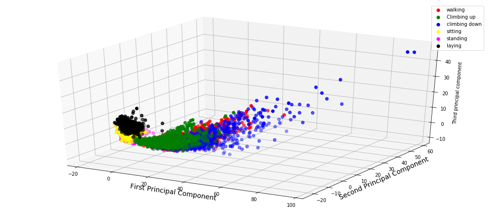

This repository contains the human activity recoginition data using smartphones 
the data is available on the UCI machine learning  repository 

http://archive.ics.uci.edu/ml/datasets/Human+Activity+Recognition+Using+Smartphones 

two files are there Activity recogintion data visualisation which contains the data analysis and checking the balancing of the data 

 <h2> Data of different Activities </h2>
 

second file contains the clustering done on the data using kmeans and expectation maximisation gaussian mixture model 

then dimensionality reduction is done using PCA and then after the reduction again clustering is done and analysed what changes in the data

has occured and also parameters to select the number of components
